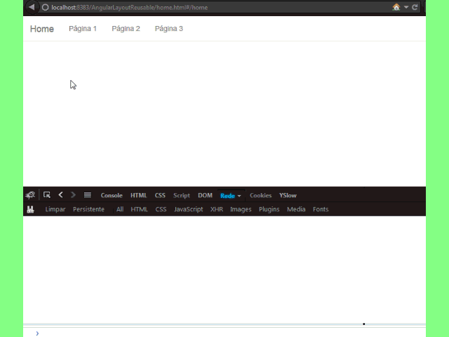

#Como Reusar Partes Estáticas com Angular

&nbsp;&nbsp;&nbsp;&nbsp;&nbsp;&nbsp;Aplicação modelo usando AngularJS para aplicação de templates, fazendo o 
reuso das partes estáticas, somente são requisitadas as partes que são diferentes. 
&nbsp;&nbsp;&nbsp;&nbsp;&nbsp;&nbsp;Por padrão já é feito o (cache) das (partials) partes que são  
requisitadas e injetadas no escopo principal. 
&nbsp;&nbsp;&nbsp;&nbsp;&nbsp;&nbsp;Caso queira desabilitar todo ou parte do cache descomente o arquivo (cache.js)
<a href="public_html/resources/angular/cache/cache.js">Disable cache</a> 

Tecnologias | Logo
:-------------: | :-------------:
Angular JS | </a>
Bootstrap | </a>

  
### Show Action   
</a>
